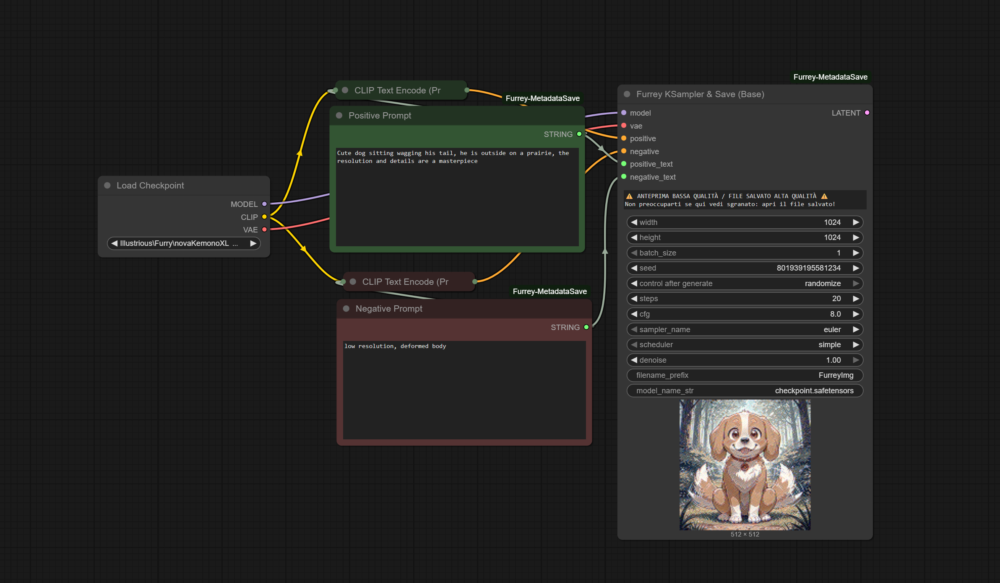
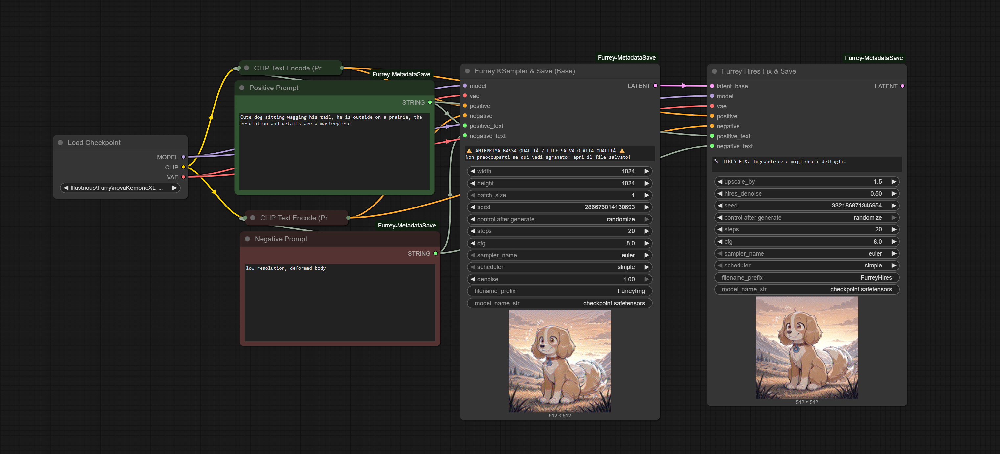
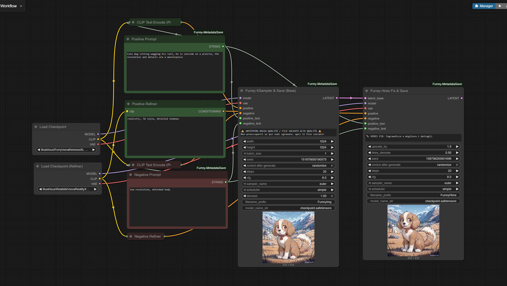

# 🦊 Furrey-MetadataSave for ComfyUI

A suite of simple, intuitive, and "All-in-One" nodes for ComfyUI. 
Designed to save metadata readable by Automatic1111/CivitAI and to simplify the workflow by reducing the number of nodes needed.

## ✨ Features

*   **💾 Easy Metadata Save**: Saves images with full parameters (Prompt, Model, Seed, CFG, etc.) in a format readable by "PNG Info" tools (Automatic1111 style).
*   **🚀 All-in-One KSampler**: Combines Model, VAE, KSampler, and Saver into one powerful node. Includes resolution selection and GPU optimization.
*   **✨ Hires Fix / Refiner**: Seamlessly upscale and refine your images connecting just one node.

## 📦 Installation

### Via ComfyUI Manager (Recommended)
1. Search for "Furrey-MetadataSave" (once indexed).
2. Click Install.

### Manual Installation
1. Go to your `ComfyUI/custom_nodes/` directory.
2. Clone this repo:
   ```git clone https://github.com/SilentLuxRay/ComfyUI_Furrey-MetadataSave```
3. Restart ComfyUI.
### 🖼️ Workflows & Examples
1. Basic Metadata Save
Simple usage to save your images with embedded metadata.

2. All-in-One Generator
Generate high-quality SDXL images without the clutter of empty latents or separate VAE decodes.

3. Hires Fix & Refiner
How to connect the Refiner node for high-resolution upscaling.



Created by Furrey for the ComfyUI community.
